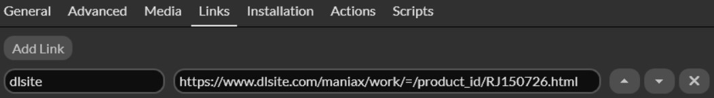

 

  

<h3 align="center">DLsiteMetadata</h3>

  

    Playnite metadata plugin that fetch from DLsite 
  

  

### Installation

1. Download and install the latest release from the [releases page](https://github.com/Mysterken/DLsiteMetadata/releases/tag/latest).

## Usage

Supported [fields](https://api.playnite.link/docs/api/Playnite.SDK.Plugins.MetadataField.html):
- Age rating
- Background Image
- Community Score
- Cover Image
- Description
- Developers
- Genres
- Icon
- Links
- Name
- Publishers
- Release Date
- Series

### Getting metadata directly from the game page

If you can't find the game you're looking for in the search results, you can get the metadata directly from the game page by giving the game's URL.   
To do this, you need to add a new link to the game with the name `dlsite` and the link's URL.

#### Example

### Configuration

You can configure the plugin by going to the plugin settings and setting the following values:

| Name                                   | Default value  | Description                                                            |
|----------------------------------------|----------------|------------------------------------------------------------------------|
| Game category                          | All categories | What DLsite category should the plugin fetch from                      |
| Page Language                          | English        | The page locale language                                               |
| Include Illustrators as Developers     | No             | This will include Illustrators in the Developers field in Playnite     |
| Include Scenario Writers as Developers | No             | This will include Scenario Writers in the Developers field in Playnite |
| Include Music Creators as Developers   | No             | This will include Music Creators in the Developers field in Playnite   |
| Include Voice Actors as Developers     | No             | This will include Voice Actors in the Developers field in Playnite     |
| Max Search Results                     | 30             | Maximum amount of search results that should appear                    |

## Roadmap

- [x] Add the possibility to fetch metadata from every category at once
- [ ] Automatic .pext packaging at every release
- [ ] Add tests

## Acknowledgments

* [erri120's Playnite.Extensions](https://github.com/erri120/Playnite.Extensions)

